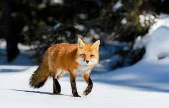

# Foxes are awesome
This will serve as a brief description of your project. Limit this to three sentences because it can become overly long at that point. This copy should draw the user in and make she/him want to read more.

| **Engineer** | **School** | **Area of Interest** | **Grade** |
|:--:|:--:|:--:|:--:|
| Samuel Nolan | University of Michigan | Electrical Engineering | Sophmore

---

Foxes are small to medium-sized, omnivorous mammals belonging to several genera of the family Canidae. They have a flattened skull, upright triangular ears, a pointed, slightly upturned snout, and a long bushy tail (or brush).

Twelve species belong to the monophyletic "true foxes" group of genus Vulpes. Approximately another 25 current or extinct species are always or sometimes called foxes; these foxes are either part of the paraphyletic group of the South American foxes, or of the outlying group, which consists of the bat-eared fox, gray fox, and island fox.

Foxes live on every continent except Antarctica. The most common and widespread species of fox is the red fox (Vulpes vulpes) with about 47 recognized subspecies. The global distribution of foxes, together with their widespread reputation for cunning, has contributed to their prominence in popular culture and folklore in many societies around the world.
 
The hunting of foxes with packs of hounds, long an established pursuit in Europe, especially in the British Isles, was exported by European settlers to various parts of the New World.

Here is a video looking at fox in the wild. It's pretty cute

{:target="_blank" rel="noopener"}

Here's a fox pic that I linked in a folder which is where the majority of your photos will be.

<HTML>
  
   Foxes live on every continent except Antarctica. The most common and widespread species of fox is the red fox (Vulpes vulpes) with about 47 recognized subspecies. The global distribution of foxes, together with their widespread reputation for cunning, has contributed to their prominence in popular culture and folklore in many societies around the world. The hunting of foxes with packs of hounds, long an established pursuit in Europe, especially in the British Isles, was exported by European settlers to various parts of the New World.
  
</HTML>

[//]: <> (This is also a comment. weofmwpgomwqrpgomqwrgpwqrmg[owmqgqwomrgpqwormgwqpormommmmmmmmmmmmmmmmmmmmmmmmmmmmmmmmmmmmmmmmmmmmmmmmmmmmmmmmmmmmmmmmmmmmmmmmmmmmmmmmmmmmmmmmmmmmmmmmmmmmmmmmmmmmmmmmmmmmmmmmmmmmmmmmmmmmmmmmmmmmmmmmmmmmmmmmmmmmmmmmmmmmmmmmmmmmmmmmmmmmmmmmmmmmmmmm)
